<picture>
  <source media="(prefers-reduced-motion: reduce) and (max-width: 600px)" srcset="docs/assets/readme/hero-mobile-static.png">
  <source media="(prefers-reduced-motion: reduce)" srcset="docs/assets/readme/hero-static.png">
  <source media="(max-width: 600px)" srcset="docs/assets/readme/hero-mobile.gif">
  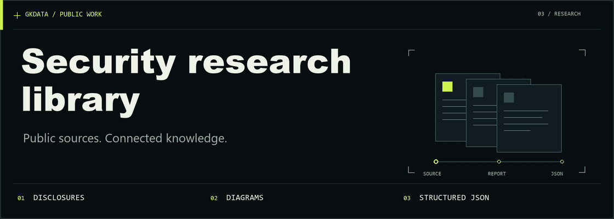
</picture>

# Security Research Library

Source-backed public disclosures, official learning resources, and original diagrams for security researchers, bug hunters, and authorized offensive-security teams. Each report preserves its evidence, root cause, bounded impact, and security lessons; structured JSON supports retrieval and analysis.

**Evidence-led:** [data policy](DATA_POLICY.md) · **Open reuse:** [CC BY 4.0 educational content](LICENSE.md#educational-content-cc-by-40) · [MIT software](LICENSE.md#software-mit)

### Browse the library

**[Browse by vulnerability type](docs/vulnerability-types.md)** — reports, related learning and conceptual diagrams together, with broader security themes labeled separately.

<p align="center">
  <a href="docs/reports.md">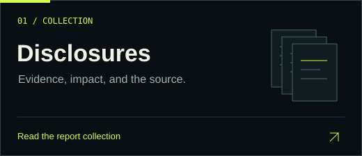</a>
  <a href="docs/programs.md">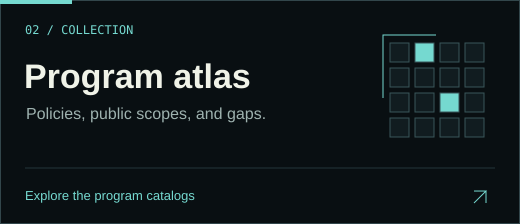</a>
  <a href="docs/resources.md">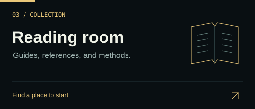</a>
  <a href="docs/diagram-gallery.md">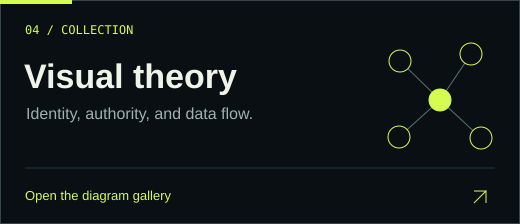</a>
  <a href="#use-the-json">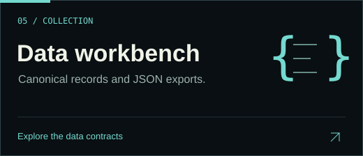</a>
  <a href="#why-the-python-scripts-are-included">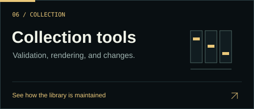</a>
</p>

<details>
<summary><strong>Full catalog and reference index</strong></summary>

| Explore | Guides and catalogs |
|---|---|
| **Disclosures** | [Read reports](docs/reports.md) · [Report topics](docs/report-topics.md) |
| **Programs** | [Verified programs](docs/programs.md) · [Public Bugcrowd programs](docs/bugcrowd-programs.md) · [Public bounty scopes](docs/public-bounties.md) |
| **Coverage** | [Scope coverage audit](docs/program-scope-audit.md) · [Discovery queue](docs/program-discovery.md) · [Program change checker](#check-program-changes) |
| **Learn** | [Research methodology](docs/research-methodology.md) · [Learning guide](docs/learning-guide.md) · [Resources](docs/resources.md) · [Readable resource catalog](docs/resource-index.md) · [Resource topics](docs/resource-topics.md) |
| **Visuals** | [Diagram gallery](docs/diagram-gallery.md) · [Visual guide](docs/visual-theory.md) |
| **Reuse** | [Use the JSON](#use-the-json) · [Licensing](LICENSE.md) |

</details>

**On this page:** [Snapshot](#at-a-glance) · [Start here](#start-here) · [Visual theory](#see-the-boundaries) · [Report anatomy](#what-each-report-contains) · [JSON contracts](#use-the-json) · [Collection tools](#why-the-python-scripts-are-included) · [Report index](#report-index) · [Scope and attribution](#scope-maintenance-and-attribution)

## At a glance

**Snapshot: October 3, 2026**

- **66 qualifying report records:** 55 bug-bounty awards and 11 explicitly labeled competition entries
- **40 public program-policy summaries**, maintained separately from award evidence
- **627 observed public bounty candidates** across Bugcrowd, HackerOne and Intigriti; 591 have published asset-scope rows captured, and five Bugcrowd category listings have unconfirmed paid status
- **516 currently visible public Bugcrowd programs** across Bug Bounty and Vulnerability Disclosure; 507 have published scope rows captured and nine have explicit gaps in the [Bugcrowd catalog](docs/bugcrowd-programs.md)
- **850 distinct program pages** across the overlapping Bugcrowd and cross-platform catalogs; 808 have captured scope rows and 42 retain precise limitations in the [coverage audit](docs/program-scope-audit.md)
- **1,156 distinct official directory program-page listings** in a separate [discovery queue](docs/program-discovery.md); listing metadata is not a full policy review
- **117 educational resources** and **12 conceptual diagrams**, maintained separately from award reports
- **USD 10,000 minimum reported award** per qualifying report or competition entry
- **Publication coverage:** 25 within October 3, 2025–October 3, 2026; 32 older; 9 with unknown original publication dates

These counts describe the collection at the review date. Award evidence is attributed to its source; it is not an independent audit of payment. Historical records and uncertain dates remain explicitly labeled.

## Current research focus

Curation currently prioritizes web-application security relevant to 2026: authorization and business logic, API and OAuth boundaries, browser policy, modern server/client frameworks, and AI-connected applications. The reviewed program directory includes dated scope-asset snapshots. The [public Bugcrowd catalog](docs/bugcrowd-programs.md) covers both public Bug Bounty and Vulnerability Disclosure listings in the October 3 directory snapshot, with per-program in-scope and out-of-scope rows or a specific capture gap. A separate [public bounty scope catalog](docs/public-bounties.md) covers bounty candidates across Bugcrowd, HackerOne and Intigriti. The [scope coverage audit](docs/program-scope-audit.md) reconciles their 293 overlapping Bugcrowd bounty pages and lists every unresolved gap. These table captures do not promote discovery listings to fully reviewed policy records. Each source and scope snapshot carries its own review time.

## Start here

| If you want to… | Start with… |
|---|---|
| Find a disclosure and inspect its evidence | [Complete report index](#report-index), then the linked JSON record |
| Study hypotheses, code review, contained exercises and evidence | [Research methodology](docs/research-methodology.md) |
| Study defensive design principles by topic | [Defensive learning guide](docs/learning-guide.md) |
| Find standards, documentation, and controlled training | [Official learning resources](docs/resources.md) |
| Understand a security boundary visually | [Visual guide](docs/visual-theory.md), with SVGs, source graphs, and evidence links |
| Build a local catalog or analysis | [JSON exports and schemas](#use-the-json) |
| Understand inclusion and editorial decisions | [Evidence and maintenance policy](DATA_POLICY.md) |

### Explore by topic

- [Account recovery and identity binding](docs/learning-guide.md#6-account-recovery-and-identity-binding)
- [Authorization consistency and safe serialization](docs/learning-guide.md#7-cross-api-consistency-and-safe-serialization)
- [Cloud identities and integration permissions](docs/learning-guide.md#2-cloud-identities-and-integration-permissions)
- [Build systems and dependency provenance](docs/learning-guide.md#3-build-systems-and-dependency-provenance)
- [AI tools and persistent-state authorization](docs/learning-guide.md#4-ai-tools-and-persistent-state-authorization)
- [Parser contracts and memory safety](docs/learning-guide.md#5-parser-contracts-and-memory-safety)
- [Approval and concurrency integrity](docs/learning-guide.md#1-approval-and-concurrency-integrity)
- [Browser permission and consent lifecycle](docs/learning-guide.md#8-browser-permission-and-consent-lifecycle)

## See the boundaries

Explore the library's conceptual models of identity, authority, and data flow. Each cover opens the complete diagram.

<p align="center">
  <a href="diagrams/ai-content-authority-separation.svg">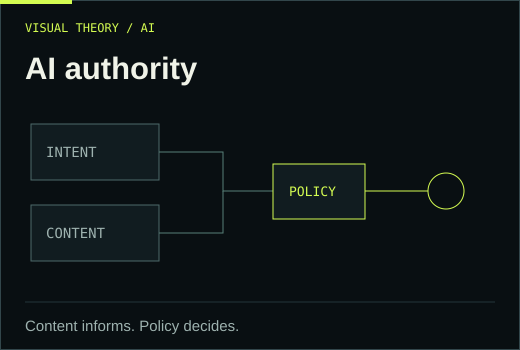</a>
  <a href="diagrams/browser-message-authority-boundaries.svg">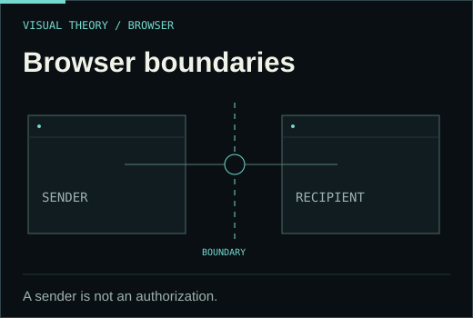</a>
  <a href="diagrams/build-artifact-provenance-boundary.svg">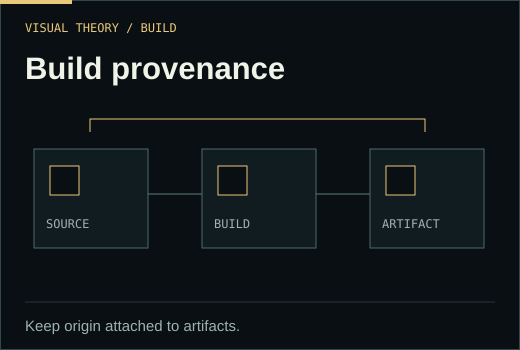</a>
</p>

[**All diagrams →**](docs/diagram-gallery.md) · [Visual theory and evidence](docs/visual-theory.md) · [Mermaid, DOT, and SVG sources](diagrams/)

## What each report contains

<picture>
  <source media="(prefers-reduced-motion: reduce) and (max-width: 600px)" srcset="docs/assets/readme/evidence-mobile-static.png">
  <source media="(prefers-reduced-motion: reduce)" srcset="docs/assets/readme/evidence-static.png">
  <source media="(max-width: 600px)" srcset="docs/assets/readme/evidence-mobile.gif">
  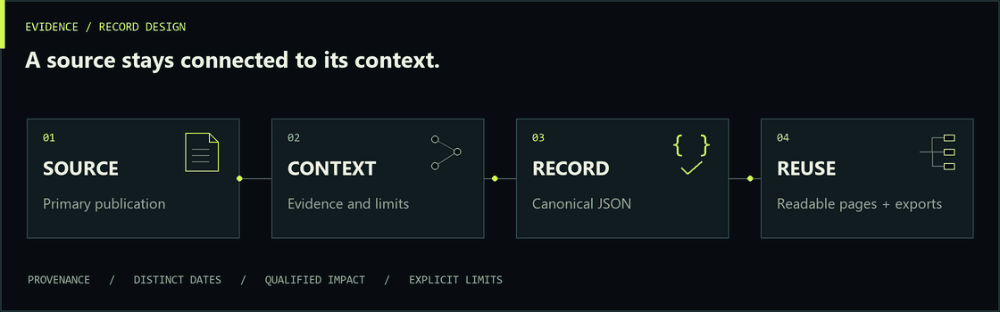
</picture>

Records contain original explanations, not just source links: `root_cause` describes the failed security assumption, `impact` qualifies what the evidence establishes, and `defensive_takeaways` captures review and remediation principles. Award evidence, distinct event dates, classifications and verification limits remain machine-readable. Where the source supports it, the explanation includes the researcher’s conceptual reasoning. Specific discovery methods or patch implementations stay unknown when the source does not establish them.

## Use the JSON

<picture>
  <source media="(max-width: 600px)" srcset="docs/assets/readme/workbench-mobile.png">
  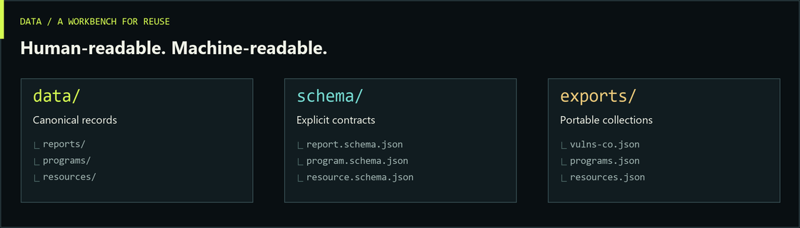
</picture>

Canonical records live in `data/`; files in `exports/` are deterministic, generated snapshots. A record's filename matches its stable `id`.

| Collection | Canonical records | Schema | Portable export |
|---|---|---|---|
| Official directory observations | [data/program-discovery/](data/program-discovery/) | [Discovery schema](schema/program-discovery.schema.json) | [exports/program-discovery.json](exports/program-discovery.json) |
| Public bounty scope captures | [data/public-bounty-scopes.json](data/public-bounty-scopes.json) | [Capture schema](schema/public-bounty-scopes.schema.json) | [exports/public-bounties.json](exports/public-bounties.json) |
| Bugcrowd public VDP scope captures | [data/bugcrowd-vdp-scopes.json](data/bugcrowd-vdp-scopes.json) | [VDP capture schema](schema/bugcrowd-vdp-scopes.schema.json) | [exports/bugcrowd-programs.json](exports/bugcrowd-programs.json) |
| Reconciled scope coverage | The three program collections above | Validated by [scope audit exporter](scripts/export_scope_audit.py) | [exports/program-scope-audit.json](exports/program-scope-audit.json) |
| Public program policies | [data/programs/](data/programs/) | [Program schema](schema/program.schema.json) | [exports/programs.json](exports/programs.json) |
| Award-backed reports | [data/reports/](data/reports/) | [Report schema](schema/report.schema.json) | [exports/vulns-co.json](exports/vulns-co.json) |
| Educational resources | [data/resources/](data/resources/) | [Resource schema](schema/resource.schema.json) | [exports/resources.json](exports/resources.json) |
| Conceptual diagrams | [data/diagrams/](data/diagrams/) | [Diagram schema](schema/diagram.schema.json) | Included in [resources.json](exports/resources.json) |

- **Report export:** includes reports, taxonomy, counts, review dates, and inclusion policy. `reports[]` contains the records. The export uses schema version `1.2.0`; the report schema accepts unchanged record versions `1.0.0`, `1.1.0` and `1.2.0`. Optional `report_identity.kind: source_label` requires record version `1.2.0` and stores an exact primary-source report label in `value`, with `source_id` and `evidence_location`. CVE identities remain supported in `1.1.0` and `1.2.0`. Older strict-schema clients must load the updated schema before consuming source-label records. Exporting never upgrades individual records.
- **Program export:** schema version `1.5.0` adds `asset_scope` snapshots to the 40 reviewed program records. Each snapshot separates in-scope and out-of-scope entries, carries official source IDs and a review time, and labels whether it came from a published platform table or a policy-defined category. The [readable program directory](docs/programs.md) shows both lists and the [JSON export](exports/programs.json) preserves them. Zero explicit out-of-scope rows never means unrestricted scope; policy prose and product-specific rules still apply. The earlier optional `scope_context` holds high-level summaries, while `program_type` and submission status remain independent. Existing `1.1.0`–`1.4.0` records remain schema-compatible; current official terms control and this library grants no testing authorization.
- **Public bounty scope export:** covers 627 bounty candidates from the official Bugcrowd, HackerOne and Intigriti directory observations. It combines the 23 matching reviewed paid-bounty policies with 568 additional published scope-table captures; 36 candidates have preview-only, terms-only, empty structured-scope or failed-fetch states. The [visual catalog](docs/public-bounties.md) has one page per candidate. HackerOne `offers_bounties` flags resolve otherwise unknown directory classifications; excluded nonbounty listings stay in the source capture for auditability. Five Bugcrowd Bug Bounty-tab listings lack displayed monetary rewards and retain unconfirmed paid status. A scope table is not a full policy review or a live authorization decision.
- **Public Bugcrowd program export:** the October 3 directory pass found all 293 Bug Bounty and 223 Vulnerability Disclosure entries advertised on the public listing feed. The [combined visual catalog](docs/bugcrowd-programs.md) and [JSON export](exports/bugcrowd-programs.json) cover all 516 current listings; 507 have source-linked published scope rows and nine have explicit missing-row or fetch-failure states. This is a dated public-directory snapshot, not a claim about private or unlisted programs.
- **Scope coverage audit:** reconciles 627 bounty candidates and 516 Bugcrowd listings with 293 overlapping pages. The [visual audit](docs/program-scope-audit.md) and [JSON audit](exports/program-scope-audit.json) cover 850 distinct pages: 808 with captured scope rows and 42 unresolved gaps. Repeated source rows were collapsed while preserving their counts; 77 such rows appeared across the two canonical capture files. The audit checks generated page row counts and retains official-page gap reviews. These counts describe dated public snapshots and do not establish full policy verification or current authorization.
- **Resource export:** includes `resources[]`, `diagrams[]`, resource taxonomy, and skillset definitions. Asset paths are relative to this repository. Read type IDs from the exported taxonomy. Official maintainer security advisories and security-release notices now use `maintainer-advisory`; researcher articles and academic papers remain `research-paper`. Classification follows the primary publication, not corroborating sources. Existing `research-paper` filters intentionally return fewer records; select both IDs to retain the former combined research/disclosure grouping. This taxonomy correction preserves record IDs, evidence, timestamps and schema versions.
- **Taxonomies:** [Report categories and defensive skills](data/taxonomy.json) · [Resource types and topics](data/resource-taxonomy.json)
- **Candidate queues:** [Report candidates](data/candidates.json) · [Resource candidates](data/resource-candidates.json). These are research leads and exclusion decisions, not included records.
- **Diagram assets:** [diagrams/](diagrams/) contains SVG, Mermaid (`.mmd`), and Graphviz (`.dot`) companions. Both text formats come from the canonical graph; the SVGs are rendered with Graphviz, not a Mermaid engine.

The `vulns-co.json` filename identifies a future adaptation target. Compatibility with a vulns.co ingestion API has not been established; this repository does not perform ingestion or deployment.

### Interpret the evidence carefully

- **Award type and scope matter.** Competition entries are labeled separately from bug bounties. A chain or team entry is counted once, not once per CVE or researcher. Program maximums, career earnings, and event totals do not qualify.
- **Awarded is different from paid.** Use `reward.status`, `reward.evidence_level`, the evidence source, and the record's limitations together. Researcher-published vendor correspondence remains researcher-published evidence. Where an individual source uses only $, any contextual USD inference and its temporal gap are stated in the record; program-wide currency context does not confirm an individual payment’s denomination or settlement.
- **Dates have different meanings.** Publication, reporting, award, mitigation, fix, and payment dates are stored separately with precision and provenance. Unknown values remain `null`.
- **Recency follows publication.** `recency.as_of` is a review date, not evidence that a vulnerability is still present. An archive timestamp or later page update does not establish the original publication date.
- **Attribution stays explicit.** An empty researcher array means the reviewed source did not identify a researcher. Editorial CWE mappings are distinguished from source-supplied classifications.

See [DATA_POLICY.md](DATA_POLICY.md) for the complete rules.

## Why the Python scripts are included

<picture>
  <source media="(max-width: 600px)" srcset="docs/assets/readme/maintenance-mobile.png">
  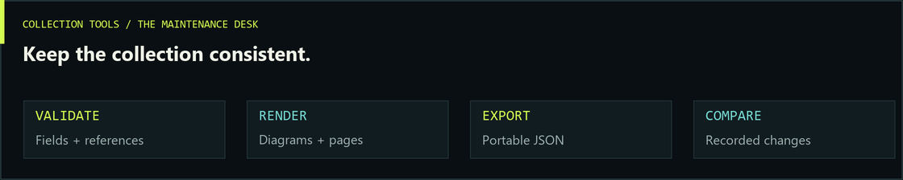
</picture>

The scripts keep the collection consistent and reusable. Reading the reports or viewing diagrams does not require running Python.

| File | Purpose |
|---|---|
| [validate.py](scripts/validate.py) | Checks report fields, source references, dates, award thresholds, taxonomy and duplicate identities |
| [validate_extra.py](scripts/validate_extra.py) | Checks resource records, diagram references and local SVG constraints |
| [export.py](scripts/export.py) | Generates the portable report JSON from validated records |
| [export_resources.py](scripts/export_resources.py) | Generates the separate resource and diagram JSON |
| [render_diagrams.py](scripts/render_diagrams.py) | Generates Mermaid/DOT source and uses local Graphviz to produce SVG diagrams |
| [build_navigation.py](scripts/build_navigation.py) | Generates readable report/resource pages, indexes and the static diagram gallery |
| [export_programs.py](scripts/export_programs.py) | Validates program-policy metadata and builds its separate export and directory |
| [export_program_discovery.py](scripts/export_program_discovery.py) | Validates official directory observations, deduplicates program pages and preserves continuation provenance |
| [export_public_bounties.py](scripts/export_public_bounties.py) | Validates dated official scope-table captures and generates the per-program public bounty catalog and JSON export |
| [export_bugcrowd_programs.py](scripts/export_bugcrowd_programs.py) | Joins current public Bugcrowd bounty and VDP listings, validates VDP captures, and generates their combined visual and JSON catalog |
| [scope_integrity.py](scripts/scope_integrity.py) | Rejects repeated asset rows and scope sources bound to a different program on the same platform |
| [export_scope_audit.py](scripts/export_scope_audit.py) | Reconciles canonical rows, overlapping catalogs, dated gap reviews and generated pages |
| [check_program_changes.py](scripts/check_program_changes.py) | Compares every stored program against a Git revision and can check recorded official public pages for change signals |
| [tests/](tests/) | Exercises the collection's validation and export rules with local fixtures |

The validators, exporters and navigation tools run offline. The optional live mode of `check_program_changes.py` makes read-only requests only to recorded official program, policy and scope-source URLs; it never requests listed assets, collects credentials, scans systems or runs disclosed vulnerabilities. Export and rendering commands write generated files inside the collection; check commands validate existing files.

## Validate and regenerate

Validation, tests, and export checks use **Python 3.10+**, the standard library, and local files. They require no network access or third-party Python packages.

```sh
python3 scripts/validate.py
python3 scripts/validate_extra.py
python3 -m unittest discover -s tests -v
python3 scripts/render_diagrams.py --check
python3 scripts/export.py --check
python3 scripts/export_resources.py --check
python3 scripts/export_programs.py --check
python3 scripts/export_program_discovery.py --check
python3 scripts/export_public_bounties.py --check
python3 scripts/export_bugcrowd_programs.py --check
python3 scripts/export_scope_audit.py --check
python3 scripts/build_navigation.py --check
```

After editing canonical records, regenerate the exports:

```sh
python3 scripts/export.py
python3 scripts/export_resources.py
python3 scripts/export_programs.py
python3 scripts/export_program_discovery.py
python3 scripts/export_public_bounties.py
python3 scripts/export_bugcrowd_programs.py
python3 scripts/export_scope_audit.py
python3 scripts/build_navigation.py
```

Regenerating SVGs also requires an installed **Graphviz `dot`** executable. Run `python3 scripts/render_diagrams.py` and visually inspect the resulting SVGs after graph edits. The renderer's `--check` compares generated source text; it does not rerender SVGs or replace visual review.

The validator implements the schema features used by this project, plus cross-record editorial checks. Extend its tests when adding schema features.

### Check program changes

The change checker covers all distinct directory listings and reviewed policies, including reviewed programs outside the directory queue. Its saved-data mode compares the current canonical records with exports at a Git commit; review timestamps, row order and duplicate-row cleanup alone do not count as program changes. It reports listing type/status, presence in the latest stored directory pass, reward and policy summaries, source status, asset rows, qualifications and bounty eligibility. Absence from one directory pass is a review signal, not proof that a program closed. Run it after updating canonical data, or compare two committed snapshots by choosing the earlier commit with `--base`.

```sh
python3 scripts/check_program_changes.py --base HEAD~1 --json-out .program-change-report.json
python3 scripts/check_program_changes.py --live --plan
python3 scripts/check_program_changes.py --live --max-requests 100 --json-out .program-change-report.json
```

Live mode checks recorded official program and policy pages plus official scope sources, defaulting to one second between requests. It stores response hashes, status and cache headers in the Git-ignored `.program-change-state.json`; the first successful request establishes a baseline. Repeat the bounded command to continue through the collection: successful checks and unavailable attempts from the previous 12 hours are skipped. Use `--skip-recent-hours 0` for an immediate recheck, `--pages-only` to omit scope-source URLs, or `--platform` / `--program` to narrow a run. Redirects are recorded but never followed, and HTTP 429 stops the batch. A changed response is a lead for manual official-policy review; it does not verify an asset-scope or eligibility change or alter canonical records.

## Report index

For prose pages with evidence and related diagrams, use the [readable report index](docs/reports.md). The links below open canonical records with source URLs, evidence notes, date provenance, and defensive takeaways. Amounts retain their scope and qualifications; they are not a severity ranking.

| Disclosure | Recorded award | Publication | Evidence |
|---|---:|---|---|
| [Google Firefly worker and storage authority](data/reports/google-firefly-worker-authority-storage-boundary-2026.json) | USD 60,000 (Firefly report) | 2026-09-11 | Researcher reproduces panel award |
| [Google Mamba temporary-output isolation](data/reports/google-mamba-temporary-output-isolation-2026.json) | USD 37,604.40 (Mamba report) | 2026-09-11 | Researcher reproduces panel award |
| [Chrome graphics input validation weakened an isolation boundary](data/reports/google-chrome-angle-input-validation-2026.json) | USD 250,000 | 2026-09-03 | Vendor confirmed |
| [Codex command approval relied on inconsistent parser semantics](data/reports/openai-codex-command-parser-approval-consistency-2026.json) | USD 40,000 (competition entry) | 2026-09-01 | Competition organizer confirmed |
| [Codex automated Git operations trusted repository hook settings](data/reports/openai-codex-repository-hook-execution-trust-2026.json) | USD 20,000 (competition entry) | 2026-09-01 | Competition organizer confirmed |
| [Codex metadata collection trusted repository execution helpers](data/reports/openai-codex-repository-metadata-helper-trust-2026.json) | USD 10,000 (competition entry) | 2026-09-01 | Competition organizer confirmed |
| [Apple PCC startup archive processing lacked path confinement](data/reports/apple-pcc-boot-archive-path-validation-2026.json) | USD 150,000 | 2026-07-31 | Researcher reproduces vendor offer |
| [Google device grants lost client and permission binding](data/reports/google-device-authorization-client-scope-binding-2026.json) | USD 13,337 | 2026-07-15 | Researcher reported |
| [Redis replication state changes invalidated an active interpreter](data/reports/redis-replication-interpreter-lifetime-2026.json) | USD 30,000 (competition entry) | 2026-06-02 (year inferred) | Competition organizer confirmed |
| [Redis deserialization cleanup violated object-ownership invariants](data/reports/redis-deserialization-object-ownership-2026.json) | USD 30,000 (competition entry) | 2026-06-02 (year inferred) | Competition organizer confirmed |
| [Google Application Integration mixed resource and service authority](data/reports/google-application-integration-authorization-boundaries-2026.json) | USD 75,000 (base award) | 2026-05-22 | Researcher reported |
| [Meta service-identity exposure amplified by excessive secret access](data/reports/meta-service-identity-secrets-trust-boundary-2026.json) | USD 150,000 | 2026-05-28 | Researcher reproduces vendor message |
| [PostgreSQL cryptographic parsing omitted a buffer-capacity check](data/reports/postgresql-pgcrypto-buffer-capacity-validation-2026.json) | USD 30,000 (competition entry) | 2026-05-04 (year inferred) | Competition organizer confirmed |
| [MariaDB JSON normalization exceeded allocated buffer capacity](data/reports/mariadb-json-normalization-buffer-capacity-2026.json) | USD 30,000 (competition entry) | 2026-05-04 (year inferred) | Competition organizer confirmed |
| [PostgreSQL text-encoding invariant failure caused memory corruption](data/reports/postgresql-multibyte-validation-cve-2026-2006.json) | USD 30,000 (competition entry) | 2026-05-04 | Competition organizer confirmed |
| [Google support API exposed customer and agent data](data/reports/google-support-api-authorization-2026.json) | USD 14,337 | 2026-03-31 | Researcher reproduces vendor message |
| [V8 optimized object handling retained invalid type assumptions](data/reports/google-chrome-v8-type-consistency-2025.json) | USD 50,000 | 2026-03-17 | Vendor confirmed |
| [Gemini Enterprise connected-content trust failure allowed persistent-memory modification](data/reports/google-gemini-enterprise-connected-content-memory-integrity-2026.json) | USD 15,000 | 2026-03-12 | Researcher reported |
| [Angular automation trust and cache isolation weakness](data/reports/angular-ci-cache-trust-2026.json) | USD 31,337 (contextually inferred currency) | 2026-03-03 | Researcher reproduces vendor message |
| [PostgreSQL extension estimator trusted an unchecked input type](data/reports/postgresql-extension-input-type-validation-2026.json) | USD 30,000 (competition entry) | 2026-02-12 (vendor advisory) | Competition organizer confirmed |
| [V8 control-flow analysis omitted required initialization checks](data/reports/google-chrome-v8-initialization-checks-2025.json) | USD 50,000 | 2026-01-22 | Vendor confirmed |
| [Gemini-to-Colab rendering boundary exposed Workspace data](data/reports/google-gemini-colab-rendering-boundary-2025.json) | USD 20,000 | 2025-11 | Researcher reproduces vendor message |
| [Kestrel HTTP framing differed across proxy and application boundaries](data/reports/microsoft-kestrel-http-framing-consistency-2025.json) | USD 10,000 | 2025-11-07 | Researcher reported |
| [GitHub package-source trust allowed dependency confusion](data/reports/github-ruby-dependency-confusion-2025.json) | USD 20,000 | 2025-10-28 | Researcher reported |
| [Redis Lua object lifetime failure crossed the scripting boundary](data/reports/redis-lua-object-lifetime-isolation-2025.json) | USD 40,000 (competition entry) | 2025-10-06 | Competition organizer confirmed |
| [GitHub comparison output lacked source-repository authorization](data/reports/github-cross-repository-comparison-authorization-2025.json) | USD 10,000 | 2025-09-23 (historical) | Vendor confirmed |
| [Support integration exposed internal Confluence documentation](data/reports/hackerone-support-confluence-access-boundary-2025.json) | USD 12,500 (one report; two recipients) | 2025-08 (historical) | Vendor confirmed |
| [Cloud Build approval was not bound to immutable code](data/reports/google-cloud-build-approval-toctou-2025.json) | USD 30,000 | 2025-07-21 (historical) | Researcher reported |
| [NVIDIA container initialization inherited untrusted execution context](data/reports/nvidia-container-runtime-environment-trust-2025.json) | USD 30,000 (competition entry) | 2025-07-17 (historical) | Competition organizer confirmed |
| [Google IDX worker messaging crossed browser trust boundaries](data/reports/google-idx-worker-message-trust-2025.json) | USD 22,500 | 2025-07-02 (historical) | Researcher reproduces vendor image |
| [Actifio driver execution exposed excessive shared-service authority](data/reports/google-actifio-driver-service-identity-isolation-2025.json) | USD 10,000 | 2025-05-04 (historical) | Researcher reported |
| [Framework serialization change exposed private HackerOne user attributes](data/reports/hackerone-report-json-serialization-data-exposure-2025.json) | USD 25,000 | 2025-04-01 (historical) | Vendor confirmed |
| [YouTube creator metadata exposed private email addresses](data/reports/youtube-creator-email-authorization-2025.json) | USD 20,000 | 2025-03-13 (historical) | Researcher reported |
| [GitLab recovery delivery lacked verified-address binding](data/reports/gitlab-recovery-address-binding-cve-2023-7028.json) | USD 35,000 | 2025-02-26 (historical) | Vendor confirmed |
| [YouTube and Pixel Recorder exposed cross-product identity links](data/reports/youtube-pixel-recorder-identity-privacy-2025.json) | USD 10,633 | 2025-02-12 (historical) | Researcher reported |
| [GraphQL object authorization exposed private-program metadata](data/reports/hackerone-private-program-graphql-object-authorization-2025.json) | USD 25,000 | 2025-01-21 (historical) | Vendor confirmed |
| [LiteSpeed Cache privileged user simulation relied on weak security tokens](data/reports/litespeed-cache-user-simulation-authentication-2024.json) | USD 14,400 (Zero Day component) | 2024-08-21 (historical) | Platform confirmed |
| [Bard Workspace integration weakened output-data boundaries](data/reports/google-bard-workspace-output-boundary-2024.json) | USD 20,000 | 2024-03-04 (historical) | Researcher reported |
| [GitHub runner-image builds shared persistent infrastructure with untrusted workflows](data/reports/github-runner-image-build-isolation-2023.json) | USD 20,000 | 2023-12-20 (historical) | Researcher reports payment |
| [Instagram embedding fallback changed the authorization context](data/reports/instagram-embedding-privileged-fallback-2023.json) | USD 14,500 (including bonuses) | 2023-10-12 (historical) | Researcher reported |
| [Meta Quest login migration lost OAuth credential confinement](data/reports/meta-quest-oauth-redirect-confidentiality-2022.json) | USD 44,250 (including bonuses) | 2023-01-29 (historical) | Vendor confirmed |
| [Meta account verification weakened linked SMS authentication state](data/reports/meta-account-verification-attempt-state-binding-2022.json) | USD 27,200 | 2023-01-20 (historical) | Vendor confirmed |
| [Pixel lock-screen completion lost security-state binding](data/reports/google-pixel-lock-screen-state-binding-2022.json) | USD 70,000 | 2022-11-10 (historical) | Researcher reproduces vendor decision |
| [Instagram client configuration exposed an application credential](data/reports/instagram-application-credential-client-containment-2022.json) | USD 30,000 (base only) | 2022-07-20 (vendor bulletin; historical) | Vendor confirmed |
| [GitHub Actions trust depended on invalid repository references](data/reports/github-actions-reference-validation-2021.json) | USD 25,000 | 2021-03-17 (historical) | Researcher reported |
| [GitHub fork collaboration applied inconsistent authorization](data/reports/github-fork-collaboration-authorization-2021.json) | USD 20,000 | 2021-03-10 (historical) | Researcher reported |
| [GitHub GraphQL collaboration changes lacked author consent](data/reports/github-fork-collaboration-consent-2021.json) | USD 10,000 | 2021-03-10 (historical) | Researcher reported |
| [Microsoft account recovery lacked consistent attempt-limit enforcement](data/reports/microsoft-account-recovery-rate-limit-consistency-2021.json) | USD 50,000 | 2021-03-02 (historical) | Researcher reported |
| [Sign in with Apple failed to bind identity claims to the authenticated user](data/reports/apple-sign-in-identity-claim-binding-2020.json) | USD 100,000 | 2020-05-30 (historical) | Researcher reported |
| [Facebook error responses exposed unintended application data](data/reports/facebook-error-response-data-isolation-2019.json) | USD 65,000 | 2020-02-07 (historical) | Vendor confirms payment |
| [GitHub OAuth consent failed across request-method semantics](data/reports/github-oauth-method-semantics-2019.json) | USD 25,000 | 2019-11-05 (historical) | Researcher reported |
| [Instagram recovery challenges were insufficiently bound to accounts](data/reports/instagram-recovery-challenge-account-binding-2019.json) | USD 10,000 | 2019-08-25 (historical) | Researcher reported |
| [Instagram mobile account recovery had inconsistent verification limits](data/reports/instagram-mobile-recovery-attempt-limits-2019.json) | USD 30,000 | 2019-07-14 (historical) | Researcher reported |
| [Shopify Exchange screenshot service crossed internal boundaries](data/reports/shopify-exchange-request-isolation-2019.json) | USD 25,000 | 2019-04-03 (historical) | Vendor confirmed |
| [Shopify automatic account conversion lost merchant-consent binding](data/reports/shopify-collaborator-conversion-consent-2017.json) | USD 20,000 | 2018-02-22 (historical) | Vendor confirmed |
| [Facebook SDK message authentication relied on insecure randomness](data/reports/facebook-sdk-message-authentication-randomness-2023.json) | USD 66,000 | Original unknown; archive shows 2026-01-17 | Researcher reported |
| [Meta Pixel cross-window handling lost message and token authority](data/reports/meta-pixel-cross-window-authority-binding-2024.json) | USD 32,500 | Original unknown; archive shows 2026-01-16 | Researcher reported |
| [Meta AI media access lacked object-ownership authorization](data/reports/meta-ai-media-object-authorization-2025.json) | USD 10,000 | Unknown; updated 2025-07-16 (historical) | Researcher reproduces vendor message |
| [Safari origin confusion undermined stored media permissions](data/reports/apple-safari-media-permission-origin-confusion-2020.json) | USD 75,000 | Unknown in primary source | Researcher reported |
| [iCloud sharing consent and Safari trust boundaries failed together](data/reports/apple-icloud-sharing-consent-safari-origin-boundary-2022.json) | USD 100,500 | Unknown in primary source | Researcher reported |
| [macOS SMBFS error handling left inconsistent kernel parser state](data/reports/apple-smbfs-parser-state-consistency-2026.json) | USD 20,000 | Original unknown; vendor advisory 2026-09-14 | Researcher reports payment |
| [Meta Conversions API Gateway mixed configuration data with executable output](data/reports/meta-conversions-gateway-generated-script-boundary-2025.json) | USD 250,000 (Bug #2 only) | Original unknown; archive shows 2026-01-13 | Researcher reported |
| [Meta Accounts Center linking lost credential and identity confinement](data/reports/meta-accounts-center-linking-credential-confinement-2024.json) | USD 30,000 | Original unknown; archive shows 2026-01-15 | Researcher reported |
| [Meta Conversions API Gateway trusted message origins as script authority](data/reports/meta-conversions-gateway-message-origin-boundary-2024.json) | USD 62,500 (Bug #1 only) | Original unknown; archive shows 2026-01-13 | Researcher reported |
| [Facebook phone linking lacked account-specific authorization](data/reports/facebook-phone-linking-account-authorization-2013.json) | USD 20,000 (contextually inferred currency) | 2013-06-26 | Researcher reported |
| [HackerOne exports omitted internal-attachment authorization](data/reports/hackerone-export-attachment-authorization-2016.json) | USD 12,500 (contextually inferred currency) | 2016-11-30 | Platform confirmed |

## Scope, maintenance, and attribution

The collection uses public primary sources, minimal attributed quotations, and original summaries, under a [public-content-only policy](DATA_POLICY.md#public-content-only-rule). It excludes private user, client, and internal information, secret values, exploit payloads, reproduction steps, operational attack chains, and live-target inventories. Public disclosure does not grant permission to test a system.

The diagrams are conceptual learning models, not claims about a vendor's exact architecture. The scripts validate, render, and export repository data; they do not discover vulnerabilities or test targets.

For updates, follow the [maintenance policy](DATA_POLICY.md#release-procedure): verify primary sources, preserve stable identities and uncertainty, refresh recency, validate, and regenerate the affected outputs. A review that finds no qualifying new source needs no filler record.

## Licensing

Original maintenance code, tests and schemas use [MIT](LICENSES/MIT.txt). Original educational documentation, summaries and diagrams use [CC BY 4.0](LICENSES/CC-BY-4.0.txt). See the [license scope and attribution guide](LICENSE.md) for canonical JSON, mixed exports and third-party exclusions. Facts are not claimed as proprietary; source reports and quotations retain their own rights.


