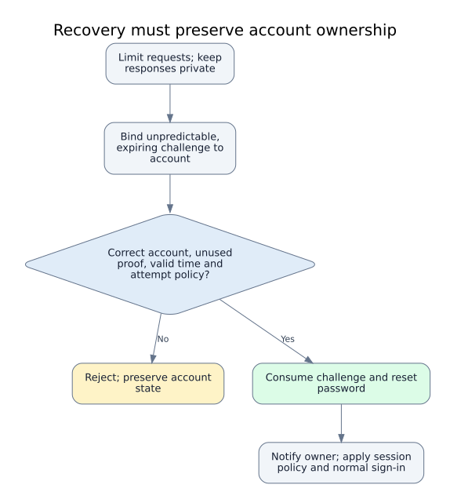
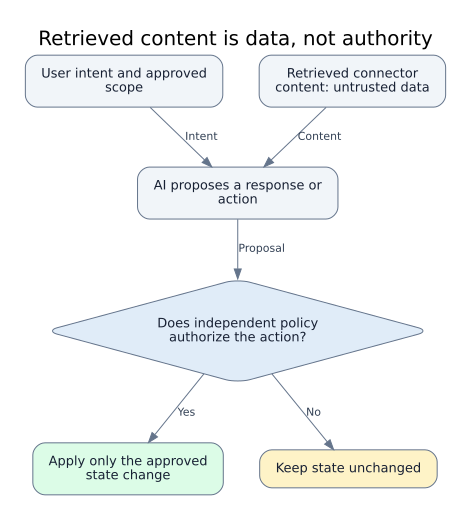
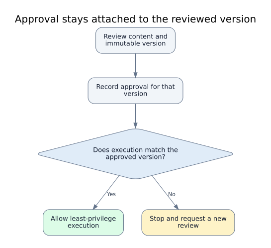
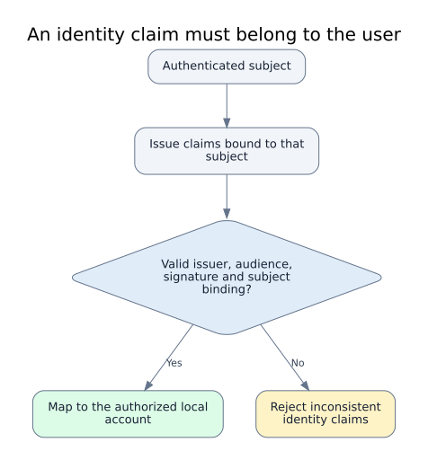
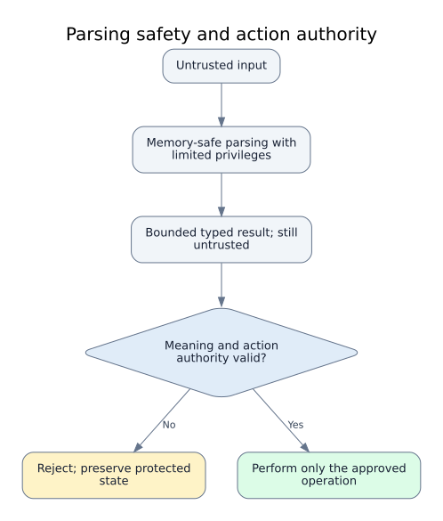
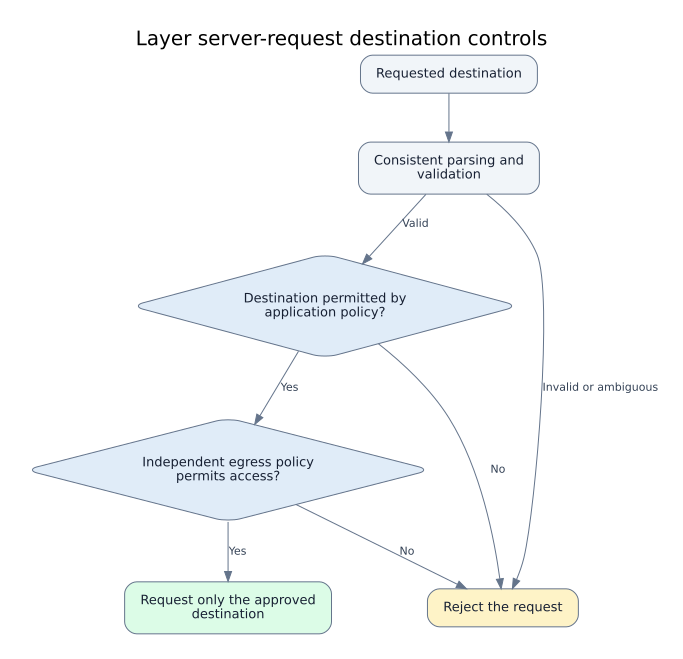

# Diagram gallery

[Library home](../README.md) · [Report index](reports.md) · [Visual learning guide](visual-theory.md)

Original conceptual defensive models. Images are local, inert SVGs; no script, embeds, external dependencies or interactive links. These are not vendor architecture diagrams or operational sequences.

## Recovery must preserve account ownership

Editorial conceptual model derived from the linked cases and official guidance; not a vendor architecture diagram or an exploitation sequence\.

**Related reports**

- [GitLab recovery delivery lacked verified-address binding](<reports/gitlab-recovery-address-binding-cve-2023-7028.md>)
- [Microsoft account recovery lacked consistent attempt-limit enforcement](<reports/microsoft-account-recovery-rate-limit-consistency-2021.md>)
- [Instagram recovery challenges were insufficiently bound to accounts](<reports/instagram-recovery-challenge-account-binding-2019.md>)

[Canonical graph and provenance](<../data/diagrams/account-recovery-challenge-lifecycle.json>) · [Mermaid source](<../diagrams/account-recovery-challenge-lifecycle.mmd>) · [DOT source](<../diagrams/account-recovery-challenge-lifecycle.dot>)

## Retrieved content is data, not authority

Editorial conceptual model derived from the linked cases and official guidance; not a vendor architecture diagram or an exploitation sequence\.

**Related reports**

- [Gemini Enterprise connected-content trust failure allowed persistent-memory modification](<reports/google-gemini-enterprise-connected-content-memory-integrity-2026.md>)
- [Gemini-to-Colab rendering boundary exposed Workspace data](<reports/google-gemini-colab-rendering-boundary-2025.md>)

[Canonical graph and provenance](<../data/diagrams/ai-content-authority-separation.json>) · [Mermaid source](<../diagrams/ai-content-authority-separation.mmd>) · [DOT source](<../diagrams/ai-content-authority-separation.dot>)

## Approval stays attached to the reviewed version

Editorial conceptual model derived from the linked cases and official guidance; not a vendor architecture diagram or an exploitation sequence\.

**Related reports**

- [Cloud Build approval was not bound to immutable code](<reports/google-cloud-build-approval-toctou-2025.md>)
- [GitHub Actions trust depended on invalid repository references](<reports/github-actions-reference-validation-2021.md>)

[Canonical graph and provenance](<../data/diagrams/approval-version-integrity.json>) · [Mermaid source](<../diagrams/approval-version-integrity.mmd>) · [DOT source](<../diagrams/approval-version-integrity.dot>)

## Browser messages need separate trust checks

Original defensive model combining OWASP messaging and authorization guidance with the linked historical cases\. These are independent design checks, not a vendor patch diagram or an operational reproduction\.

**Related reports**

- [Facebook SDK message authentication relied on insecure randomness](<reports/facebook-sdk-message-authentication-randomness-2023.md>)
- [Meta Pixel cross-window handling lost message and token authority](<reports/meta-pixel-cross-window-authority-binding-2024.md>)

[Canonical graph and provenance](<../data/diagrams/browser-message-authority-boundaries.json>) · [Mermaid source](<../diagrams/browser-message-authority-boundaries.mmd>) · [DOT source](<../diagrams/browser-message-authority-boundaries.dot>)

## Build evidence must match the artifact and trusted builder

Editorial conceptual model combining the Angular case with SLSA build guidance\. The case supports separating automation trust and shared build state; the consumer verification gate is a general design synthesis, not a reconstruction of Angular remediation\. Assumes a defined trust policy for builders and provenance\. Provenance presence alone does not establish authenticity, and passing these checks does not prove the software is free of vulnerabilities\.

**Related reports**

- [Angular automation trust and cache isolation weakness](<reports/angular-ci-cache-trust-2026.md>)

[Canonical graph and provenance](<../data/diagrams/build-artifact-provenance-boundary.json>) · [Mermaid source](<../diagrams/build-artifact-provenance-boundary.mmd>) · [DOT source](<../diagrams/build-artifact-provenance-boundary.dot>)

## Failures need separate public and diagnostic contracts

Editorial conceptual model derived from the Facebook error-response case and OWASP error-handling and logging guidance\. The case establishes unintended response disclosure and broader framework remediation; diagnostic minimization and retention are general guidance, not claims about the vendor patch\. Assumes an application-defined public error contract and an authorized diagnostic purpose\. This model does not establish preserved authorization in fallback behavior or independent proof from logs\.

**Related reports**

- [Facebook error responses exposed unintended application data](<reports/facebook-error-response-data-isolation-2019.md>)

[Canonical graph and provenance](<../data/diagrams/error-diagnostic-disclosure-boundary.json>) · [Mermaid source](<../diagrams/error-diagnostic-disclosure-boundary.mmd>) · [DOT source](<../diagrams/error-diagnostic-disclosure-boundary.dot>)

## An identity claim must belong to the user

Editorial conceptual model derived from the linked cases and official guidance; not a vendor architecture diagram or an exploitation sequence\.

**Related reports**

- [Sign in with Apple failed to bind identity claims to the authenticated user](<reports/apple-sign-in-identity-claim-binding-2020.md>)
- [GitHub OAuth consent failed across request-method semantics](<reports/github-oauth-method-semantics-2019.md>)

[Canonical graph and provenance](<../data/diagrams/identity-claim-binding.json>) · [Mermaid source](<../diagrams/identity-claim-binding.mmd>) · [DOT source](<../diagrams/identity-claim-binding.dot>)

## Parsing safety and action authority

Editorial conceptual model derived from the linked cases and official guidance; not a vendor architecture diagram or an exploitation sequence\.

**Related reports**

- [V8 optimized object handling retained invalid type assumptions](<reports/google-chrome-v8-type-consistency-2025.md>)
- [Redis Lua object lifetime failure crossed the scripting boundary](<reports/redis-lua-object-lifetime-isolation-2025.md>)

[Canonical graph and provenance](<../data/diagrams/parsing-safety-action-authority.json>) · [Mermaid source](<../diagrams/parsing-safety-action-authority.mmd>) · [DOT source](<../diagrams/parsing-safety-action-authority.dot>)

## Server disclosure and browser interpretation

Editorial conceptual model: assumes an application with server-side privileged data and a browser consumer\. Next\.js guidance supports server authorization and minimal client-visible contracts; OWASP LLM05 supports treating generated text as untrusted at each consumer\. The linked HackerOne Rails case illustrates why serialization needs an explicit disclosure boundary; it is not evidence of Next\.js or an LLM integration\. The arrows show defensive responsibilities, not a framework execution trace\. Context-aware encoding or sanitization belongs where the output context is known, including server rendering; the lower steps do not imply exclusively client-side execution\. Rendering safety cannot replace permission checks, and authorized disclosure does not make content safe to interpret\.

**Related reports**

- [Framework serialization change exposed private HackerOne user attributes](<reports/hackerone-report-json-serialization-data-exposure-2025.md>)

[Canonical graph and provenance](<../data/diagrams/server-client-data-consumer-boundaries.json>) · [Mermaid source](<../diagrams/server-client-data-consumer-boundaries.mmd>) · [DOT source](<../diagrams/server-client-data-consumer-boundaries.dot>)

## Layer server-request destination controls

Original conceptual defense-in-depth model linked to the historical Shopify Exchange case and OWASP guidance\. It is not a vendor architecture diagram\. Policy must fit the service’s destination requirements\.

**Related reports**

- [Shopify Exchange screenshot service crossed internal boundaries](<reports/shopify-exchange-request-isolation-2019.md>)

[Canonical graph and provenance](<../data/diagrams/server-request-destination-policy.json>) · [Mermaid source](<../diagrams/server-request-destination-policy.mmd>) · [DOT source](<../diagrams/server-request-destination-policy.dot>)

## Keep workload authority tenant-scoped

Editorial conceptual model derived from the linked cases and official guidance; not a vendor architecture diagram or an exploitation sequence\.

**Related reports**

- [Meta service-identity exposure amplified by excessive secret access](<reports/meta-service-identity-secrets-trust-boundary-2026.md>)
- [Actifio driver execution exposed excessive shared-service authority](<reports/google-actifio-driver-service-identity-isolation-2025.md>)

[Canonical graph and provenance](<../data/diagrams/workload-identity-tenant-scope.json>) · [Mermaid source](<../diagrams/workload-identity-tenant-scope.mmd>) · [DOT source](<../diagrams/workload-identity-tenant-scope.dot>)

Original diagrams: Security Research Library contributors, CC BY 4.0. [License scope](../LICENSE.md).
