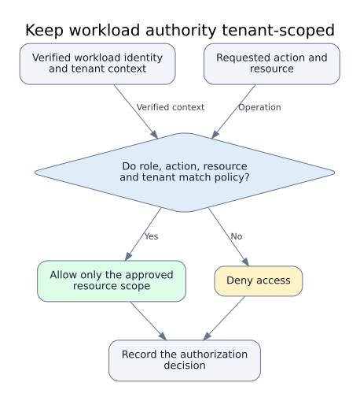
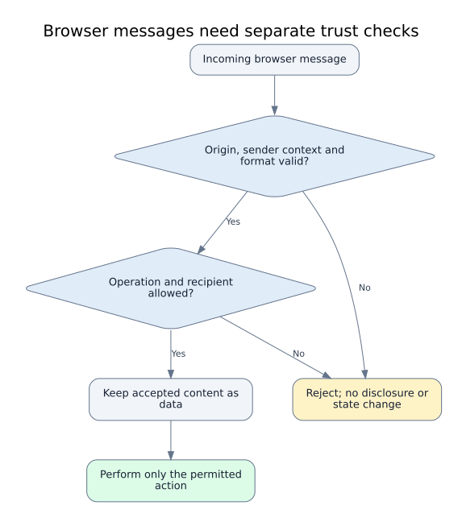

# Visual theory: defensive trust boundaries

These are original conceptual models grounded in linked disclosures and official guidance. They explain security decisions, not the exact architecture of a vendor or an exploitation sequence. Each record links its evidence and supplies accessible alternate text.

## Bind approval to an immutable version


The key invariant is that the content executed is the content approved. Validation belongs at both the decision and the privileged consumer.

[Evidence and metadata](../data/diagrams/approval-version-integrity.json) · [Mermaid source](../diagrams/approval-version-integrity.mmd)

## Separate AI content from action authority


Retrieved content can inform a response without gaining authority to change persistent state. The model's proposed action is a request to validate, not permission by itself.

[Evidence and metadata](../data/diagrams/ai-content-authority-separation.json) · [Mermaid source](../diagrams/ai-content-authority-separation.mmd)

## Preserve identity ownership across integrations


A valid signature is one check among several. The issued claims must still refer to the authenticated subject and the intended relying application.

[Evidence and metadata](../data/diagrams/identity-claim-binding.json) · [Mermaid source](../diagrams/identity-claim-binding.mmd)

## Keep workload authority tenant-scoped



Authenticating a workload does not determine everything it may access. Bind authorization to the requested operation and tenant, keep credentials short-lived where supported, and review unused permissions separately. This connects the Meta and Actifio cases with AWS IAM guidance.

[Evidence and metadata](../data/diagrams/workload-identity-tenant-scope.json) · [Mermaid source](../diagrams/workload-identity-tenant-scope.mmd)

## Layer server-request destination controls


Combine application policy with an independent network boundary. Choose destination restrictions that fit the service’s documented purpose.

[Evidence and metadata](../data/diagrams/server-request-destination-policy.json) · [Mermaid source](../diagrams/server-request-destination-policy.mmd)

## Preserve ownership through account recovery


Review challenge binding, consistent attempt accounting and post-reset session policy together. This conceptual model connects the GitLab, Microsoft and Instagram cases.

[Evidence and metadata](../data/diagrams/account-recovery-challenge-lifecycle.json) · [Mermaid source](../diagrams/account-recovery-challenge-lifecycle.mmd)

## Separate parsing safety from action authority


Memory safety and restricted privileges reduce parsing risk. They do not authorize the meaning of parsed data. Keep the final policy decision independent of the parser.

[Evidence and metadata](../data/diagrams/parsing-safety-action-authority.json) · [Mermaid source](../diagrams/parsing-safety-action-authority.mmd)

## Keep browser message identity separate from authority



Knowing where a message came from does not settle what it may request or which data its recipient may receive. Keep those decisions explicit and prevent accepted content from becoming executable markup. This is a conceptual design model, not a description of Meta’s exact patch.

[Evidence and metadata](../data/diagrams/browser-message-authority-boundaries.json) · [Mermaid source](../diagrams/browser-message-authority-boundaries.mmd)

## Respect the server-to-client disclosure boundary


A server-side origin does not make every field suitable for the browser. Project only the data the current consumer may receive, then treat returned content according to its output context.

[Evidence and metadata](../data/diagrams/server-client-data-consumer-boundaries.json) · [Mermaid source](../diagrams/server-client-data-consumer-boundaries.mmd)

## Check build evidence at the artifact consumer


Build isolation and consumer verification address different decisions. Separate untrusted contributions from trusted build state, then check whether authenticated provenance matches the artifact and expected build. Passing the gate only makes the artifact eligible for remaining release review; provenance is not a guarantee of vulnerability-free software.

[Evidence and metadata](../data/diagrams/build-artifact-provenance-boundary.json) · [Mermaid source](../diagrams/build-artifact-provenance-boundary.mmd)

## Separate public errors from internal diagnostics


Failure paths need explicit disclosure rules too. Give clients a minimal response, while selecting, minimizing and protecting diagnostic context independently. Internal logs still need a legitimate purpose, restricted access and a retention policy.

[Evidence and metadata](../data/diagrams/error-diagnostic-disclosure-boundary.json) · [Mermaid source](../diagrams/error-diagnostic-disclosure-boundary.mmd)

## Rendering and maintenance

The Mermaid and Graphviz sources are generated from the same canonical node/edge graph. The SVG companions were rendered offline with Graphviz and visually inspected. A Mermaid engine was not executed. To regenerate with an installed Graphviz version:

```sh
python3 scripts/render_diagrams.py
python3 scripts/render_diagrams.py --check
python3 scripts/validate_extra.py
```

After changing a graph, inspect the rendered SVG before marking visual QA passed. Resource and diagram metadata are included in the separate resources export.
